# Goal

## frontend practice

## CI/CD

```mermaid
graph TD
  A[portfolio-repo] -->|Push Event| B(GitHub Actions)
  B -->|Build Process| C{Workflow}
  C -->|Deploy| D[username.github.io]
  style B fill:#000,stroke:#333,stroke-width:2px 
```

- Source Repository
> portfolio — Encapsulates the core web application codebase and logic.

- Automation Trigger
> A standardized GitHub Action is invoked upon a push event to the designated deployment branch.

- Build Sequence
> The workflow executes a production build, transforming the React source code into optimized static assets.

- Distribution
> The resulting artifacts are deployed to the github.io host environment, where they are rendered as a Single Page Application (SPA).

## Problems during developemnt
This section documents the specific architectural challenges faced during the development of this project.

### Build Results

The build process generates two separate folders: client and server.

I was surprised to learn that a server-side program is typically required to handle routing for the frontend. Since GitHub Pages only supports static website rendering, I had to enable SPA (Single Page Application) mode to bundle everything into a single index.html file.

### SPA
Switching to an SPA build required several adjustments to the project structure and codebase. My first attempt failed to build entirely; however, after replacing "Loader" functions with useEffect hooks, the project built successfully.

I encountered a recurring error where npm run dev failed because .react-router already existed. Even though I managed to fix this by modifying root.tsx, the resulting website was a blank white screen, suggesting the routes in route.ts were not being applied.

Huge thanks to my friend [SP12893678](https://github.com/SP12893678), who is an expert in frontend development, for refactoring the codebase to support SPA mode without errors!

### Errorboundary not wokring with gitpage
In development, the ErrorBoundary handles routing errors correctly. However, after pushing the build to GitHub Pages, errors are caught and rendered by GitHub's default 404 page instead.

### Sidebar navigation was not handled propperly 
Local navigation via the sidebar works smoothly in dev mode. Once deployed, routes do not resolve correctly, particularly when switching between different posts rapidly.

- Assumption
> The routing issues likely stem from the fact that the website is hosted in a subfolder on GitHub Pages (e.g., username.github.io/cv/). Because of how GitHub Pages handles requests, navigating to /cv triggers GitHub's internal routing first. If the React Router is also configured with a /cv base route, a conflict occurs where GitHub’s sequential execution takes priority, potentially leading to a 404 or a broken route resolution before the app even loads.
> 
- Test - routing mechnism
> To test this, I modified the workflow to publish the artifact to a different branch within the same repository. However the routing is still not being resolved correctly.

While searching online for more information, I found this [issue](https://github.com/orgs/community/discussions/64096) on github. Following the suggested solution, I refactored the project from Framework Mode to Data Mode. This involved significant changes to package.json, vite.config.ts, and the removal of framework-specific configurations. Finally, I implemented HashRouter to wrap the application, which successfully resolved the routing conflicts.